# Design → Code Process

A repeatable, agent-assisted process for moving a UI from a design tool into this running
full-stack application — without ever putting the public app at risk.

This folder holds **the process itself**: the role definitions, the seven operator prompts, the
templates they write from, and the exporter prompt 04 runs. It is a sibling to `openspec/`:
OpenSpec governs product-value changes, this governs design versions. Neither holds application
code.

It arrived here by being **vendored once**, from a repository that no longer exists. There is no
submodule, no `@umovity/design-code-process` package, no bootstrap script and no binding
detection — this repository's layout is known, so the twelve bindings that machinery existed to
discover are written out as literal text in the seven command wrappers under
[`design-commands/`](../../design-commands/). Changing one is editing a Markdown line.

The durable conventions the prompts are held to live in `docs/`, with the rest of this
repository's durable technical guidance, not in a second home here:

| Convention | Doc |
|---|---|
| `vX.Y.Z`, `-tech`, `PUBLIC_UI_VERSION`, the reserved namespace | [`docs/design-versioning.md`](../../docs/design-versioning.md) |
| The version registry contract | [`docs/design-version-registry.md`](../../docs/design-version-registry.md) |
| `pages/design/**` layout and its four invariants | [`docs/design-folder.md`](../../docs/design-folder.md) |
| The design system's staging area and promotion rules | [`docs/design-staging.md`](../../docs/design-staging.md) |
| What is tested, when, and what deliberately is not | [`docs/design-testing.md`](../../docs/design-testing.md) |

---

## The problem this solves

A designer produces a new UI version. Historically it lands as a new `/v4` route in the app,
half-wired, competing with the version real users depend on. Every design iteration is a risk
to production, and there is no clean place for work that is *finished as design* but *not yet
integrated*.

This process separates the two lifecycles:

| | **Public versions** | **Design versions** |
|---|---|---|
| Live at | `/` (clean, unversioned URLs) | `/design/vX.Y.Z/…` |
| Data | real backends | mocked |
| Visible to | everyone | administrators only |
| Design system | shipped components | `staging/` components |
| Changes when | a technologist wires and promotes a version | a designer iterates, freely |

A design version can be created, reviewed, refined and thrown away without a single line of the
public app changing.

---

## Core concepts

### Clean public URLs

End users never see a version in the URL. `https://host/briefing` is the public app. The same
screen is *also* reachable by an administrator at `https://host/v3/briefing` for development and
comparison. A non-administrator who lands on any versioned path is redirected to the canonical
equivalent, preserving their subpath, params and query — so shared links keep working.

Which version is public is a single runtime setting, `PUBLIC_UI_VERSION`, served from the
backend. Flipping it changes what the world sees with a backend restart and **no frontend
rebuild**.

### The version registry is real code in `apps/web`

The machinery behind those clean URLs is not described, it is committed: the version table, the
rules for reading it, the public-version resolver, prefix-free navigation, the router mount and a
contract test, all under `apps/web/src/versions/`. The reference copies the prompts write from
are in [`templates/version-registry/`](templates/version-registry/); the contract they are held
to is [`docs/design-version-registry.md`](../../docs/design-version-registry.md).

### Design versions are `vX.Y.Z`

- **X** — a new design language or a reworked flow
- **Y** — new screens or flow additions within the same design language
- **Z** — refinements to existing screens
- **`-tech` suffix** — a design technologist's backend-integrated revision, awaiting designer review

See [`docs/design-versioning.md`](../../docs/design-versioning.md).

### The design system has a staging area

New and modified components live in `staging/vX.Y.Z/` inside `design-system-uds` and ship as a
**subpath export**. Publishing them produces a new registry version whose *shipped* entry point
is byte-identical to the previous one — so the public app is provably unaffected, while design
versions can consume the new components immediately.

The design system is a **separate repository**, consumed here as a published package
(`@my-app/design-system` → `@ptv-mobility/design-system-uds`). Staging and promotion happen in
that repository, against a checkout of it; see
[`docs/design-staging.md`](../../docs/design-staging.md) for the layout and
[`docs/design-system.md`](../../docs/design-system.md) for how this repository consumes it,
including the registry token every install needs.

---

## Roles

| Role | Owns | Runs |
|---|---|---|
| **Designer** | the design language, the design tool, design versions | prompts 01, 04 |
| **Design technologist** | backend wiring, promotion, what becomes public | prompts 02, 03, 05, 06, 07 |
| **Developer** | the app and design-system codebases, the conventions | reviews PRs from both |

Full definitions in [roles.md](roles.md).

---

## The loop

```mermaid
stateDiagram-v2
    direction TB
    [*] --> Design

    Design: 1. DESIGN — prompt 01
    Design: designer picks the X / Y / Z bump
    Design: creates design/vX.Y.Z, and DS staging/vX.Y.Z only if
    Design: the export needs a component the DS does not ship

    TestGate: 2. TEST GATE — human, mandatory
    TestGate: DESIGN_PREVIEW_CMD, or FULL_STACK_CMD while this
    TestGate: repository declares no preview seam; refinement prompts
    TestGate: nothing is pushed or published without "APPROVE vX.Y.Z"

    PR: 3. PULL REQUESTS
    PR: one branch per repo this run touched — two when
    PR: something was staged, one when nothing was

    Accept: 4. TECHNOLOGIST ACCEPTS
    Accept: public app provably unaffected
    Accept: /design/vX.Y.Z browsable live

    Wire: 5a. WIRE — prompt 02
    Wire: design version becomes a real prod version
    Wire: Phase A plan + questions gate

    Tech: 5b. TECH REVISION — prompt 03
    Tech: creates design/vX.Y.Z-tech
    Tech: PR up one role (technologist→designer, or developer→technologist)

    Preview: 6b. DESIGNER REVIEW — prompt 04
    Preview: preview live, export readable zip

    Public: 6a. GO PUBLIC — prompt 06
    Public: flip PUBLIC_UI_VERSION (never automatic)

    Promote: 7. PROMOTE DS — prompt 05
    Promote: staging folded into shipped, republished

    Clean: 8. CLEAN UP — prompt 07
    Clean: delete superseded design versions (manual only)

    Design --> TestGate
    TestGate --> Design: refinements
    TestGate --> PR: magic word given
    PR --> Accept
    Accept --> Wire
    Accept --> Tech
    Wire --> Public
    Wire --> Promote
    Tech --> Preview
    Preview --> Design: re-import to the design tool
    Promote --> Clean
    Public --> [*]
```



The loop closes at step 6b: the designer exports a **readable source tree**, the design tool
rebuilds it as editable design components, the designer tweaks it visually, and the tool's
"Handoff to Claude Code" export becomes the input to prompt 01 again.

The loop can also be entered from the other side. When the last design version is no longer what
ships, prompt 04's **production export** (§4) hands the design tool the registry's production entry
directly — every file its screens reach, the design system they use, and, for a wired version, the
API answers the host recorded or a plain statement that there are none — with no `-tech` revision
in between.

### What a designer needs on their machine

Less than the whole product:

- **Always:** Node 22, pnpm through `corepack`, and an `.env` (`pnpm run prepare` writes one).
- **A way to reach `/design/*`.** Those routes are administrator-only, so a design version needs a
  runtime *and* an administrator session. This repository declares **no** design-preview seam
  today — `DESIGN_PREVIEW_CMD` is empty in every wrapper — so a designer runs `FULL_STACK_CMD`
  (`pnpm run dev`: Podman, PostgreSQL, the .NET API and Vite). When the seam lands, filling that
  one wrapper line is the whole adoption. `FRONTEND_ONLY_CMD` is **not** a third option: it starts
  the server and seeds no session, so the designer lands on the public app and reads it as the
  version being broken.
- **Only when the version stages a design-system component:** a checkout of
  `PTV-Mobility/design-system-uds` (prompt 04's exporter needs it in *source* form — `node_modules`
  ships `dist/` and structurally cannot serve it) and a registry token to publish it. On a run
  whose components all turn out to be adoption gaps — the measured common case, prompt 01 §4.2 —
  neither is needed.

---

## The prompts

| # | Prompt | Run by | Gate |
|---|---|---|---|
| 01 | [create-design-version](prompts/01-create-design-version.md) | designer | **magic word** before any push **or registry publish** — `--publish-on-approve` is the default and moves the design-system publish to the approval boundary; `--publish` opts back into publishing mid-run |
| 02 | [wire-version-to-backend](prompts/02-wire-version-to-backend.md) | technologist | **Phase A stop** — plan + questions before any code |
| 03 | [tech-revision](prompts/03-tech-revision.md) | technologist → designer, **or** developer → technologist | PR up one role |
| 04 | [preview-and-export](prompts/04-preview-and-export.md) | designer | — |
| 05 | [promote-ds-staging](prompts/05-promote-ds-staging.md) | technologist | **hard stop** on a breaking props diff |
| 06 | [promote-public-version](prompts/06-promote-public-version.md) | technologist | explicit confirmation — never automatic |
| 07 | [clean-design-versions](prompts/07-clean-design-versions.md) | technologist | **manual trigger only**, no automation |

You do not invoke a prompt directly. You invoke its wrapper in
[`design-commands/`](../../design-commands/), which names the prompt and carries this
repository's bindings. For **when to reach for each one and ready-to-use example invocations**,
see [COMMANDS.md](COMMANDS.md).

---

## Folder map

```
README.md                      this file — the process at a glance
COMMANDS.md                    when to use each prompt + ready-to-use example invocations
roles.md                       designer / design technologist / developer

prompts/                       the seven operator prompts
fixtures/                      hand-written stand-ins for inputs from outside the process
templates/
  design-tool-brief.md         what the designer is handed
  pr-description.md            the PR description template
  version-registry/            the registry reference — src/versions/ and the API side
scripts/
  export-design-version.mjs    prompt 04's exporter: a design version (§3) or the production
                               entry (§4, --mode production) to a readable source tree
  capture-fixtures.mjs         §4's mock data: GET-only recording from a local stack, from a
                               plan the host writes
  curate-fixtures.mjs          §4's declared edits to recorded fixtures, contract-checked
  *.test.mjs                   their tests — `pnpm run test:design-process`
```

Outside this folder: the five conventions in `docs/` (table at the top), the seven wrappers in
`design-commands/`, and the registry itself in `apps/web/src/versions/`.
